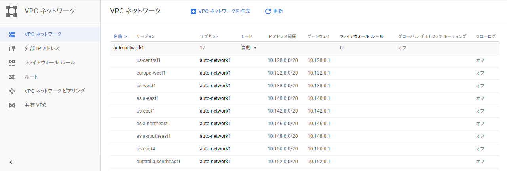
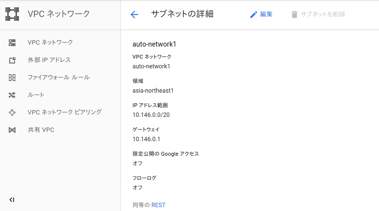
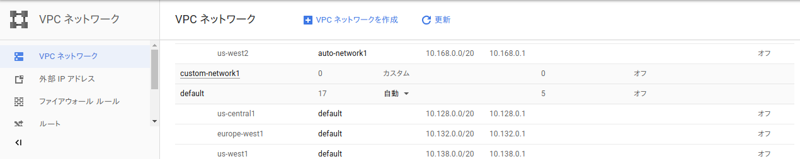
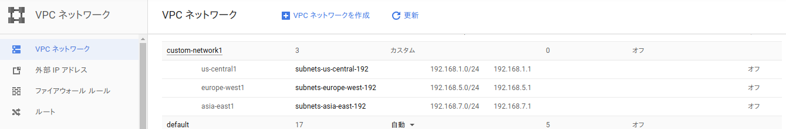
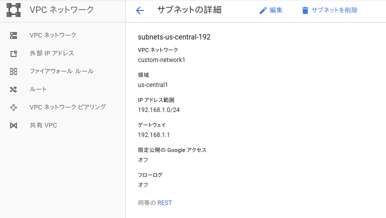
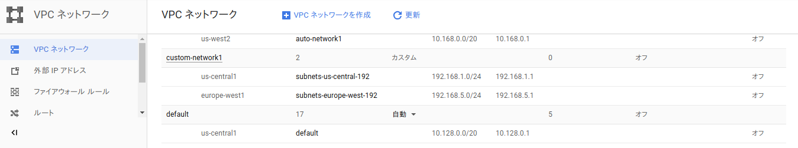

# Virtual Private Cloud（VPC）

https://cloud.google.com/vpc/docs/using-vpc?authuser=1&hl=ja

- VPCネットワークには、「自動モード」と「カスタムモード」がある。
- １プロジェクトにつき、５ネットワークまで作れる。（※デフォルトも含め）
- ネットワークモードを自動からカスタムに切り替えられる。（一方向のみ）
- サブネットの IP 範囲を拡張できる。縮小はできない。

## 自動モードのVPCネットワーク作成
<pre>
$ gcloud compute networks create auto-network1 --subnet-mode auto
</pre>
<pre>
Created [https://www.googleapis.com/compute/v1/projects/XXXXXXXX/global/networks/auto-network1].
NAME           SUBNET_MODE  BGP_ROUTING_MODE  IPV4_RANGE  GATEWAY_IPV4
auto-network1  AUTO         REGIONAL

Instances on this network will not be reachable until firewall rules
are created. As an example, you can allow all internal traffic between
instances as well as SSH, RDP, and ICMP by running:

$ gcloud compute firewall-rules create <FIREWALL_NAME> --network auto-network1 --allow tcp,udp,icmp --source-ranges <IP_RANGE>
$ gcloud compute firewall-rules create <FIREWALL_NAME> --network auto-network1 --allow tcp:22,tcp:3389,icmp
</pre>

### 作成結果
リージョン毎にサブネットが１つずつ作られる。

#### アジアリージョンの詳細

## カスタムサブネットを使用してVPCネットワーク作成
<pre>
$ gcloud compute networks create custom-network1 --subnet-mode custom
</pre>
<pre>
Created [https://www.googleapis.com/compute/v1/projects/XXXXXXXX/global/networks/custom-network1].
NAME             SUBNET_MODE  BGP_ROUTING_MODE  IPV4_RANGE  GATEWAY_IPV4
custom-network1  CUSTOM       REGIONAL

Instances on this network will not be reachable until firewall rules
are created. As an example, you can allow all internal traffic between
instances as well as SSH, RDP, and ICMP by running:

$ gcloud compute firewall-rules create <FIREWALL_NAME> --network custom-network1 --allow tcp,udp,icmp --source-ranges <IP_RANGE>
$ gcloud compute firewall-rules create <FIREWALL_NAME> --network custom-network1 --allow tcp:22,tcp:3389,icmp
</pre>

### 作成結果
カスタムの場合はサブネットは勝手に作られない。

## カスタムサブネットのリージョン３つに対してサブネット作成
<pre>
$ gcloud compute networks subnets create subnets-us-central-192 --network custom-network1 --region us-central1 --range 192.168.1.0/24
$ gcloud compute networks subnets create subnets-europe-west-192 --network custom-network1 --region europe-west1 --range 192.168.5.0/24
$ gcloud compute networks subnets create subnets-asia-east-192 --network custom-network1 --region asia-east1 --range 192.168.7.0/24
</pre>
<pre>
Created [https://www.googleapis.com/compute/v1/projects/XXXXXXXX/regions/us-central1/subnetworks/subnets-us-central-192].
NAME                    REGION       NETWORK          RANGE
subnets-us-central-192  us-central1  custom-network1  192.168.1.0/24

Created [https://www.googleapis.com/compute/v1/projects/XXXXXXXX/regions/europe-west1/subnetworks/subnets-europe-west-192].
NAME                     REGION        NETWORK          RANGE
subnets-europe-west-192  europe-west1  custom-network1  192.168.5.0/24

Created [https://www.googleapis.com/compute/v1/projects/XXXXXXXX/regions/asia-east1/subnetworks/subnets-asia-east-192].
NAME                   REGION      NETWORK          RANGE
subnets-asia-east-192  asia-east1  custom-network1  192.168.7.0/24
</pre>

### 作成結果確認
<pre>
$ gcloud compute networks subnets list | grep custom-network1
subnets-asia-east-192    asia-east1               custom-network1  192.168.7.0/24
subnets-europe-west-192  europe-west1             custom-network1  192.168.5.0/24
subnets-us-central-192   us-central1              custom-network1  192.168.1.0/24
</pre>
<pre>
$ gcloud compute networks subnets describe subnets-asia-east-192 --region asia-east1
creationTimestamp: '2018-08-09T08:36:58.521-07:00'
fingerprint: XXX-XXXXXXXX
gatewayAddress: 192.168.7.1
id: '1111111111111111111'
ipCidrRange: 192.168.7.0/24
kind: compute#subnetwork
name: subnets-asia-east-192
network: https://www.googleapis.com/compute/v1/projects/XXXXXXXX/global/networks/custom-network1
privateIpGoogleAccess: false
region: https://www.googleapis.com/compute/v1/projects/XXXXXXXX/regions/asia-east1
selfLink: https://www.googleapis.com/compute/v1/projects/XXXXXXXX/regions/asia-east1/subnetworks/subnets-asia-east-192
</pre>

作成したリージョン毎にサブネットが１つずつ作られる。

#### US中央リージョンの詳細

## カスタムサブネットを削除
自動的に作成されたサブネットは個別に削除できない。削除するにはVPCネットワーク全体の削除が必要。
<pre>
$ gcloud compute networks subnets delete subnets-asia-east-192 --region asia-east1
</pre>
<pre>
The following subnetworks will be deleted:
 - [subnets-asia-east-192] in [asia-east1]

Do you want to continue (Y/n)?  y

Deleted [https://www.googleapis.com/compute/v1/projects/XXXXXXXX/regions/asia-east1/subnetworks/subnets-asia-east-192].
</pre>

### 削除結果

## VPCネットワークを削除
<pre>
$ gcloud compute networks delete auto-network1
</pre>
<pre>
The following networks will be deleted:
 - [auto-network1]

Do you want to continue (Y/n)?  y

Deleted [https://www.googleapis.com/compute/v1/projects/XXXXXXXX/global/networks/auto-network1].
</pre>
